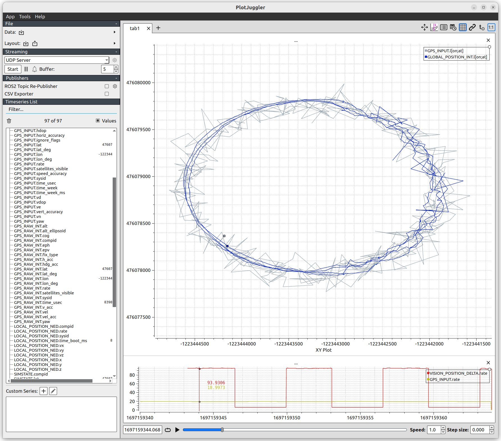
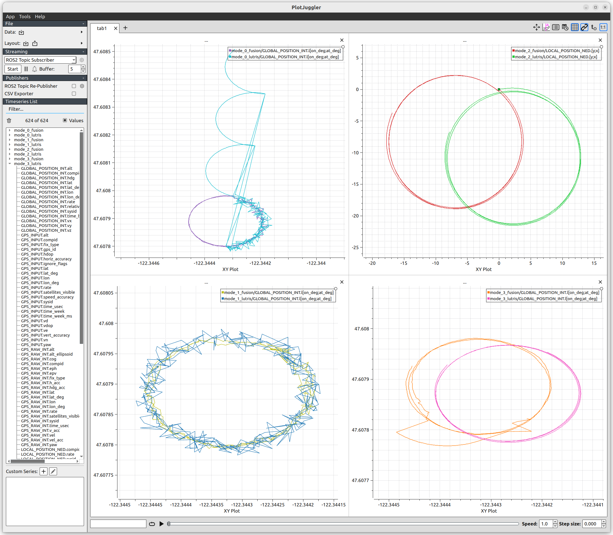

# ArduSub Localization

This project consists of Python tools to run ArduSub localization experiments.

## Overview

There are 2 tools: [SimSensors](sim_sensors.py) and [SimReplay](sim_replay.py).
Each does the following:
* Starts `$ARDUPILOT_HOME/build/sitl/bin/ardusub` and connects to it
* Sets a bunch of parameters
* Sends GPS_INPUT and VISION_POSITION_DELTA MAVLink messages to ArduSub
* Writes the MAVLINK messages to a tlog file

The source of the MAVLink messages differs:
* [SimSensors](sim_sensors.py) simulates a sub moving slowly in a circle, with the DVL turning on and off
* [SimReplay](sim_replay.py) opens a tlog file and reads the GPS_INPUT and VISION_POSITION_DELTA messages

## Usage

Build ardusub first:
~~~
cd $ARDUPILOT_HOME
./waf configure --board sitl
./waf sub
~~~

The following command will simulate a sub moving slowly in a circle for 500 seconds at 20x speed:
~~~
python sim_sensors.py --params params/fusion.params --log /tmp/fusion.tlog --speedup 20.0 --time 500
~~~

Here is the output plotted on PlotJuggler:

The sub starts at the top of the circle and moves clockwise. The gray lines shows the GPS_INPUT messages, while
the blue line shows the EKF output in the GLOBAL_POSITION_INT messages. At about 90 degrees the AHRS origin is set,
the GPS starts aiding, and the grey and blue lines diverge. At 180 degrees the DVL turns on and the EKF produces a
fairly smooth track. At the top of the circle the DVL turns off. The sub goes around the circle a little over 3 times.

To replay a previous dive with new parameters, also at 20x speed:
~~~
python sim_replay.py --params params/fusion.params --log /tmp/fusion.tlog --speedup 20.0 previous_dive.tlog
~~~

## Comparing DVL-only parameters vs fusion parameters

[compare.bash](compare.bash) runs 8 tests, 4 with DVL-only parameters and 4 with fusion parameters.
Each batch of 4 corresponds to a different sensor mode:
~~~
# Sensor modes:
#     UGPS_AND_INTERMITTENT_DVL = 0 (default) -- the UGPS is always on and the DVL turns on/off
#     UGPS_ONLY = 1
#     DVL_ONLY = 2
#     UGPS_AND_DVL = 3

# DVL-only parameters:
source run_sensors.bash params/lutris.params mode_0_lutris 20.0 400 0
source run_sensors.bash params/lutris.params mode_1_lutris 20.0 400 1
source run_sensors.bash params/lutris.params mode_2_lutris 20.0 400 2
source run_sensors.bash params/lutris.params mode_3_lutris 20.0 400 3

# Fusion parameters:
source run_sensors.bash params/fusion.params mode_0_fusion 20.0 400 0
source run_sensors.bash params/fusion.params mode_1_fusion 20.0 400 1
source run_sensors.bash params/fusion.params mode_2_fusion 20.0 400 2
source run_sensors.bash params/fusion.params mode_3_fusion 20.0 400 3
~~~

Here is a screenshot of all 8 tests in PlotJuggler:

| Plot        | Mode                         | Results for fusion parameters                   | Results for DVL-only parameters |
|-------------|------------------------------|-------------------------------------------------|---------------------------------|
| Upper left  | 0: UGPS on, DVL intermittent | Good (purple)                                   | Unusable (light blue)           |
| Lower left  | 1: UGPS on                   | Good (light green)                              | No smoothing (blue)             |
| Upper right | 2: DVL on                    | Good, but shifted (red)                         | Good (green)                    |
| Lower right | 3: UGPS on, DVL on           | Good, position corrects after GPS lock (orange) | Good, but shifted (pink)        |

## Caveats

* The simulated IMUs (accel, gyro) are indicating no movement, and therefore not aiding the EKF.
* The tools do not route or forward MAVLink messages to other systems or components. I.e., QGC will not connect.

## Reference

### Interesting MAVLink Messages

| Message               | Sender  | Value                                                 |
|-----------------------|---------|-------------------------------------------------------|
| VISION_POSITION_DELTA | Sensor  | DVL sensor data                                       |
| GPS_INPUT             | Sensor  | GPS sensor data                                       |
| GPS_RAW_INT           | ArduSub | GPS sensor data                                       | 
| GLOBAL_POSITION_INT   | ArduSub | EKF output (copies GPS_INPUT until the origin is set) |
| LOCAL_POSITION_NED    | ArduSub | EKF output in meters relative to origin               |
| GPS_GLOBAL_ORIGIN     | ArduSub | Origin (sent once when origin is set)                 |
| HOME_POSITION         | ArduSub | Origin (sent once when origin is set)                 |

### Interesting Dataflash Tables

* VISO is the same data that appears in VISION_POSITION_DELTA
* POS is the same data that appears in GLOBAL_POSITION_INT
